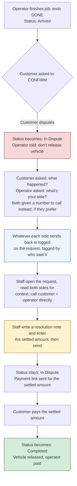

# PRD: Dispute Intake & Resolution with Adjustable Balance

**Date:** 2026-09-08
**Builds on:** Dispute Handling (2026-08-18)

## The problem

Today, when a customer disputes a job, we capture almost nothing about *why*. The customer sends
a bare `DISPUTE` keyword, staff get a WhatsApp ping with just a job reference and a dashboard
link, and the operator hears nothing at all until the case is already closed. When staff finally
sit down to resolve it, all they have is one button — "Resolve Dispute" — which closes the case
with a generic "we've reviewed it" message. It can't reflect that the customer only owes part of
the price, and there's no record of what either side actually said happened.

This matters because of *when* a dispute happens: the operator has already finished the job and
said so. The customer is being asked "do you agree this is done?" before paying the rest of what
they owe. So a dispute isn't "did the job happen" — it's "how much should I actually have to pay
for what happened, and who's holding the vehicle in the meantime." Right now, staff have to
reconstruct the whole story themselves from scratch, off-platform, with no system to fall back on.

There's also no dedicated status for "this job is currently under dispute" — it's tracked as a
side flag, invisible to anything that filters or reports by status.

**Along the way we also found and fixed two bugs in the existing flow** (already shipped,
separate from this PRD):
- A disputed job could accidentally slip through to payment/payout with the dispute still open,
  through an admin shortcut we didn't realize bypassed the dispute check.
- The "don't release the vehicle" warning was being sent to the customer instead of the operator
  — the customer never has the vehicle, so this instruction was useless to the person receiving it.

## What we're building

Three parts, together:

1. **A real "In Dispute" status**, so disputed jobs are filterable and reportable like any other
   stage, not a hidden flag.
2. **Both sides get asked for their story, automatically, the moment a dispute is raised** — not
   just the customer's bare keyword. The operator, who currently hears nothing until the case is
   already closed, gets pulled in right away too. Either side can also call a number directly
   instead of typing — reusing the same staff dispute number that already exists in platform
   settings, not a new one. Everything either side sends back is logged on the request, clearly
   tagged as coming from the customer or the operator, so staff have real context before they ever
   pick up the phone.
3. **One resolution action**: staff write a note on what was decided and enter the settled amount
   (as a % of the original balance), then send. That single action sends the payment link. Nothing
   is auto-notified at any earlier step — the system doesn't care who was "right," it just needs an
   amount and a note once staff have actually sorted it out with both parties.

**On completion timing:** the request stays **In Dispute** even after staff resolve and send the
payment link — it only becomes **Completed** once the customer actually pays. This is different
from a normal (non-disputed) job, where CONFIRM completes the job immediately, before payment. A
dispute isn't over until the money has actually moved.

**We keep both numbers.** The original balance and the final settled amount are both stored, not
one overwriting the other — so "what was quoted vs. what was actually paid" is always visible,
not just a single adjusted figure with the history gone.

**Dispute history survives past Completed.** The job keeps showing it was disputed — including
both sides' statements, the resolution note, and both amounts — even once it reaches Completed, so
it stays filterable and reviewable ("show me every dispute last month") regardless of current
stage.

**Example:** A customer disputes because the tow took much longer than promised.

1. The moment they reply `DISPUTE`, status becomes In Dispute, the operator is told not to
   release the vehicle, and both the customer and operator are asked for their side of the story
   (or given a number to call instead).
2. The customer replies with what happened. The operator replies with theirs. Both show up on the
   request for staff to read.
3. Staff read both sides, then call the customer and operator directly to sort out the details.
4. Staff write a note ("operator confirmed the 45-min delay, customer agreed to a reduced rate")
   and enter **60%** of the ₦45,000 balance, then send.
5. The customer gets a payment link for ₦27,000. Status is still In Dispute.
6. Customer pays ₦27,000 → status becomes Completed, vehicle is released, operator is paid
   (deposit share + ₦27,000, minus our fee) — same machinery as any other job from here.

## Why this approach

We're not building a full case-management system or an in-app calling feature. We're capturing
what already gets said anyway (both sides' version of events) so it isn't lost the moment the
phone call ends, and changing one number — the amount owed — at the point staff actually resolve
things. The payment, vehicle-release, and payout machinery is unchanged; it's the same pipe every
job already runs through, just fed a different number and held open a little longer.

## What's explicitly NOT included in this pass

- **"Customer owes nothing" (100% off).** The lowest settlement allowed is 1% of the balance —
  charging something, even a token amount. A true ₦0 outcome needs its own path, since the
  vehicle-release and operator-payment steps are both triggered by a real payment happening.
- **Refunding the deposit.** This only touches the *remaining balance* — money the customer hasn't
  paid yet. The deposit already paid isn't touched or refunded by this feature.
- **Splitting money with the operator at resolution time.** The operator isn't paid anything when
  staff resolve — they're paid the normal way, once the settled balance is actually paid.
- **An open-ended back-and-forth thread.** Each side gets asked once and can reply once (or call
  instead) — this isn't a live chat between customer, operator, and staff inside the app. If
  disputes turn out to need real back-and-forth beyond "one statement each," that's a follow-up.
- **Structured dispute categories.** What each side sends is free text, not a dropdown of reasons
  ("late arrival," "damage," etc.) — no reporting-by-category in this pass.
- **Photo/video evidence.** Could reuse the existing job-media upload pattern later, but isn't
  built in this pass — text statements only for now.

## What staff will see, and where

Disputes live inside the existing **admin dashboard → Requests view** — no separate "Disputes"
page. A disputed job shows **"In Dispute"** as its status, same place every other stage (Arrived,
Completed, etc.) shows. Opening the request shows:

- The customer's statement and the operator's statement (or "no response yet" if either hasn't
  replied), clearly labeled by who said it.
- A resolution box: a note field and a settlement percentage, with a single "Resolve & Send
  Payment Link" action.

Once resolved, the job still shows **"In Dispute"** until the customer pays — at which point it
becomes **Completed**, same as any job. A **"Was Disputed"** record (both statements, the
resolution note, and both amounts) stays visible and filterable on the job going forward.

## Risks / things worth a second look

- **The operator's "tell us your side" message is business-initiated**, same consideration as the
  existing staff dispute alert — outside an active WhatsApp session window, this likely needs an
  approved Content Template rather than a freeform message, or it'll get rejected by Meta. Same
  pattern we already handle for the staff alert; needs the same treatment here.
- **Capturing free-text replies from both sides means new WhatsApp conversation states** — the
  system needs to recognize "this reply is the customer's dispute statement" vs. every other
  message they might send while a dispute is open, and same for the operator.
- **Staff could mistype a percentage.** Validate it's a whole number between 1 and 100 — anything
  else is rejected with a clear error, nothing gets half-applied.
- **Adding a new status value touches anything that lists or counts statuses** (dashboards,
  filters, hardcoded status lists) — needs a check that nothing assumes only today's 11 stages
  exist.
- **A dispute that never gets a reply from one or both sides** shouldn't block staff from
  resolving anyway — statements are helpful context, not a requirement to proceed.

## How we'll know it works

- A disputed job shows "In Dispute" as its status, and stays there through resolution until
  payment actually clears.
- The moment a dispute is raised, both the customer and operator are asked for their side, and
  whatever they send back appears on the request, correctly attributed.
- Staff can resolve with a note and a settlement percentage in one action, which sends the
  customer a payment link for that amount.
- The original balance and the settled amount are both stored and visible — not one overwriting
  the other.
- Status only becomes Completed once the settled amount is actually paid, matching the same
  payment-confirmation trigger every job already uses.
- The full dispute record (both statements, the note, both amounts) remains visible after the job
  reaches Completed.
- Entering an invalid percentage (0, negative, over 100, not a whole number) is rejected upfront.
